<p align="center">
  
</p>

# 💇‍♀️ Beauty Parlour Management System


# 💇‍♀️ Beauty Parlour Management System

## 📌 Project Overview

The Beauty Parlour Management System is a desktop-based application developed using **Python** and **MySQL** to automate the daily operations of a beauty parlour. The system provides an efficient and user-friendly solution for managing customers, employees, beauty services, appointments, billing, and business reports.

This application eliminates manual record-keeping by maintaining all information in a MySQL database, ensuring data accuracy, reducing paperwork, and improving overall operational efficiency. The project follows a menu-driven approach with proper input validation, exception handling, and database connectivity to provide a smooth user experience.

---

## 🎯 Objectives

- Automate beauty parlour operations.
- Manage customer and employee records efficiently.
- Schedule and manage appointments.
- Generate bills accurately.
- Maintain business reports.
- Reduce manual paperwork and improve data management.

---

## ✨ Features

- 🔐 Secure Admin Login
- 👤 Customer Management
  - Add Customer
  - View Customers
  - Search Customer
  - Update Customer
  - Delete Customer
- 👩‍💼 Employee Management
  - Add Employee
  - View Employees
  - Search Employee
  - Update Employee
  - Delete Employee
- 💄 Service Management
  - Add Service
  - View Services
  - Search Service
  - Update Service
  - Delete Service
- 📅 Appointment Management
  - Book Appointment
  - View Appointments
  - Update Appointment
  - Cancel Appointment
  - Complete Appointment
- 💳 Billing Management
  - Generate Bill
- 📊 Reports
  - Today's Income
  - Monthly Income
  - Most Popular Services
  - Total Customers
  - Total Employees

---

## 🛠 Technologies Used

- Python
- MySQL
- mysql-connector-python
- Jupyter Notebook

---

## 📂 Project Structure

```text
Beauty-Parlour-Management-System/
│
├── Beauty Parlour Management System using Python & MySQL.ipynb
├── README.md
├── requirements.txt
├── LICENSE
├── .gitignore
└── screenshots/
```

---

## 📦 Requirements

Install the required dependency before running the project.

```bash
pip install -r requirements.txt
```

The `requirements.txt` file contains:

```text
mysql-connector-python
```

---

## 🚀 Installation

1. Clone the repository.

```bash
git clone https://github.com/your-username/Beauty-Parlour-Management-System.git
```

2. Navigate to the project folder.

```bash
cd Beauty-Parlour-Management-System
```

3. Install the required package.

```bash
pip install -r requirements.txt
```

4. Open the Jupyter Notebook.

5. Run all cells.

6. Create the required MySQL database and tables.

7. Log in as the administrator and start using the application.

---
## 📸 Project Screenshots

### 🔐 Admin Login
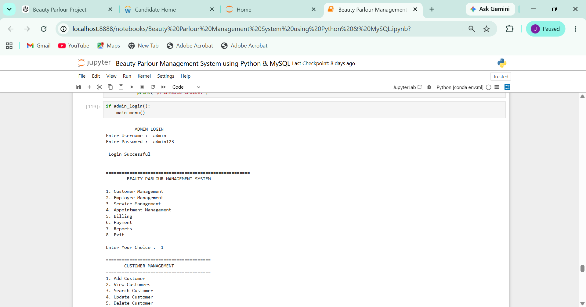

---

### 👤 Customer Management


---

### ➕ Add Customer
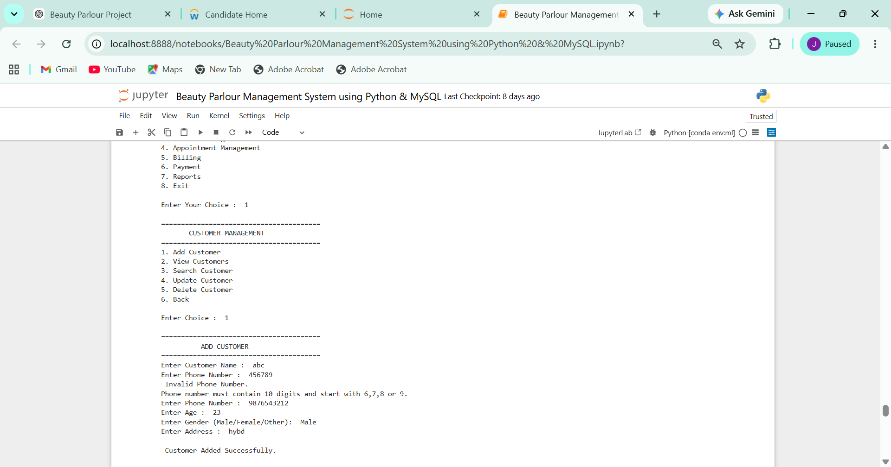

---

### 👀 View Customer
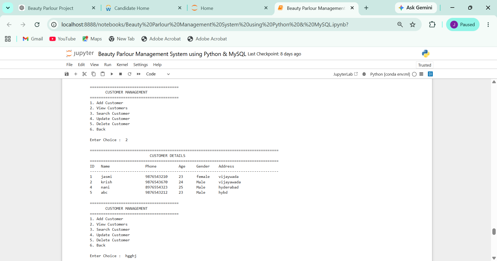

---

### 🔍 Search Customer
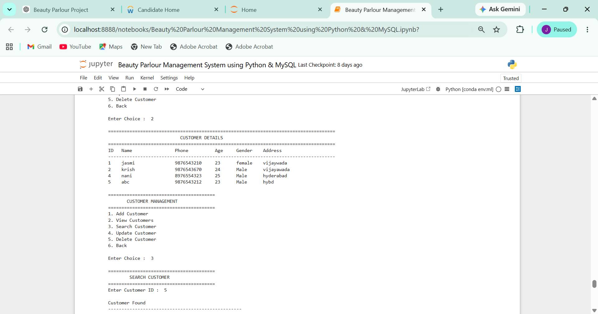

---

### ✏️ Update Customer
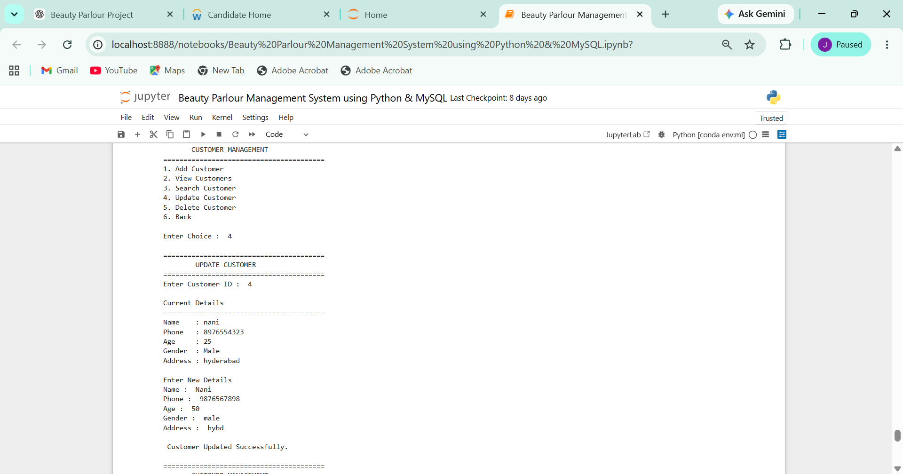

---

### 👩‍💼 Employee Management


---

### ➕ Add Employee
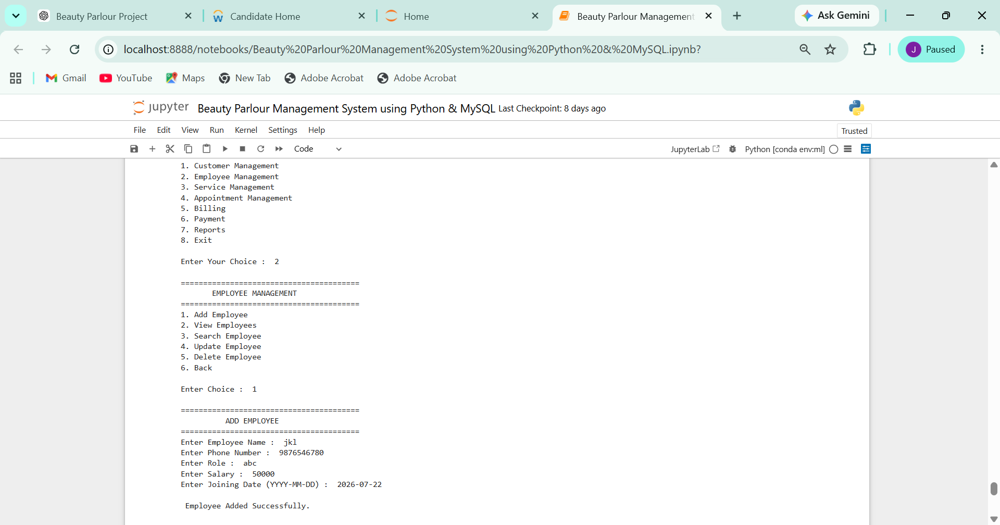

---

### 👀 View Employee
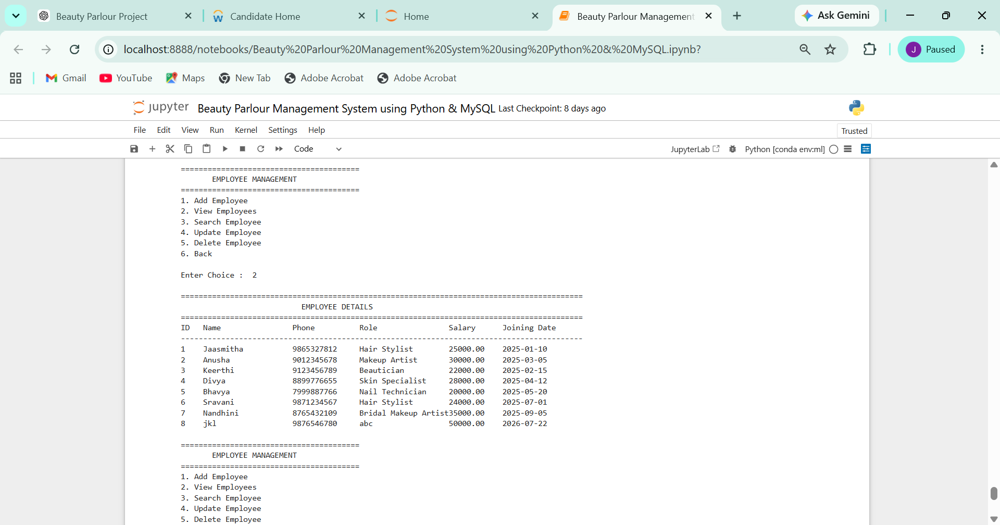

---

### 💄 Service Management


---

### ➕ Add Service
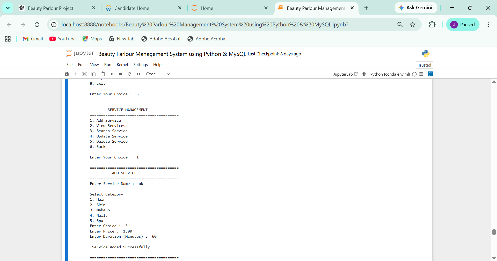

---

### 📅 Appointment Management
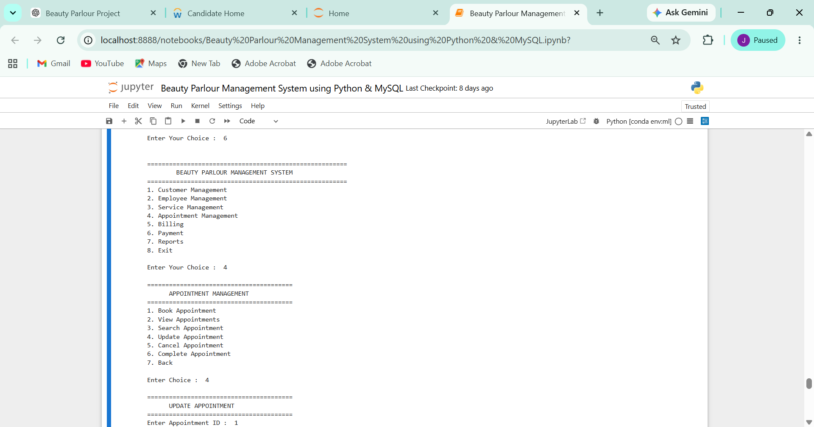

---

### ➕ Add Appointment
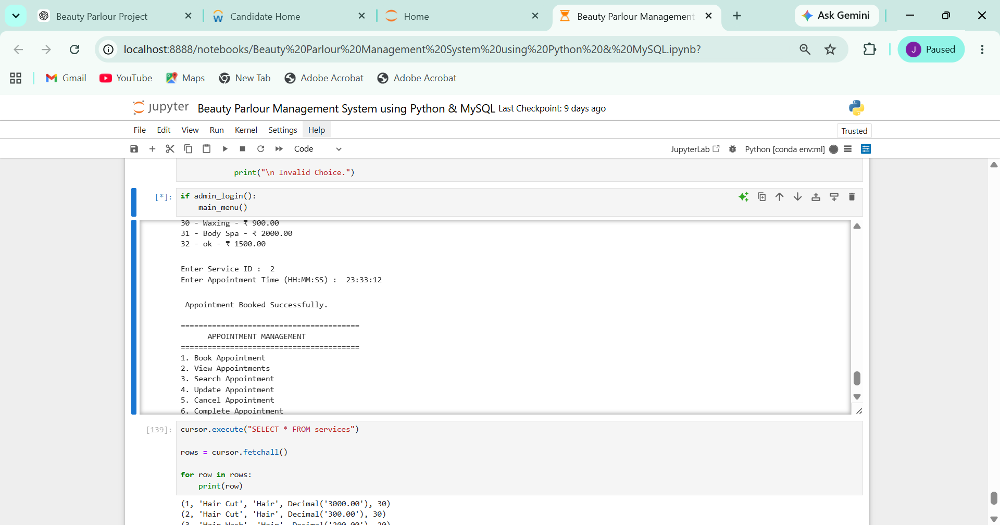

---

### 👀 View Appointment
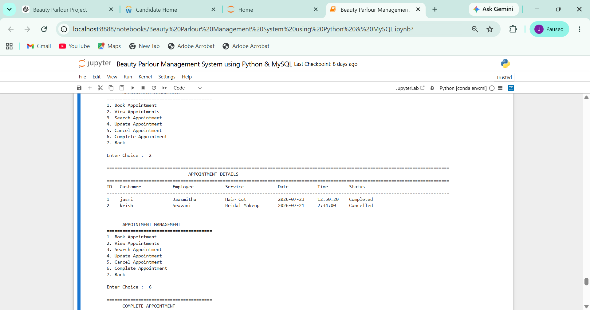

---

### ✏️ Update Appointment
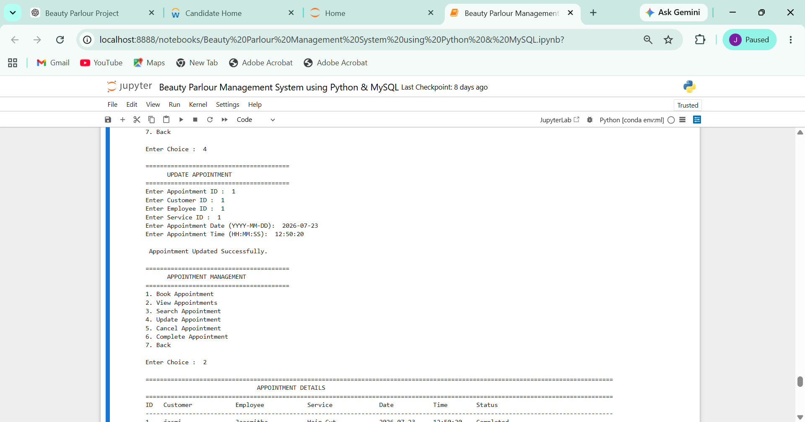

---

### ❌ Cancel Appointment


---

### ✅ Complete Appointment
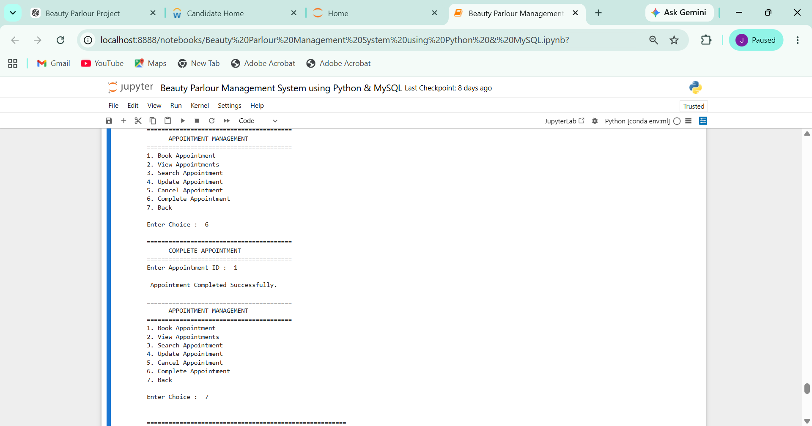

---

### 💳 Generate Bill
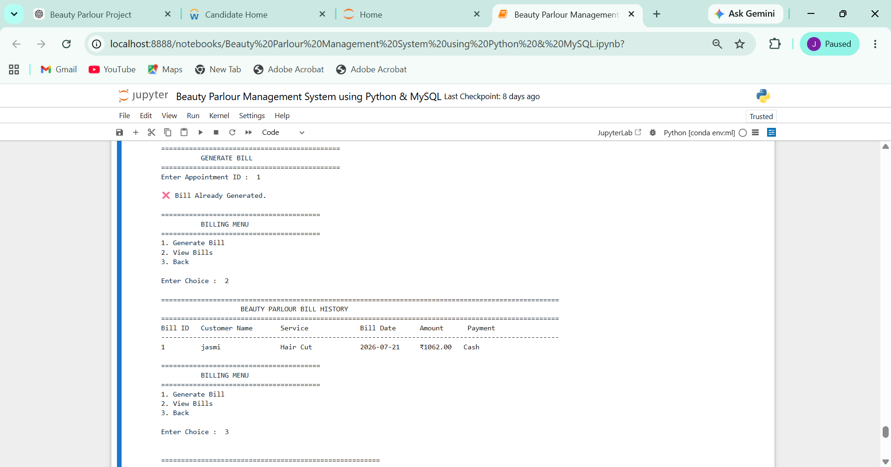

---

### 📊 Reports
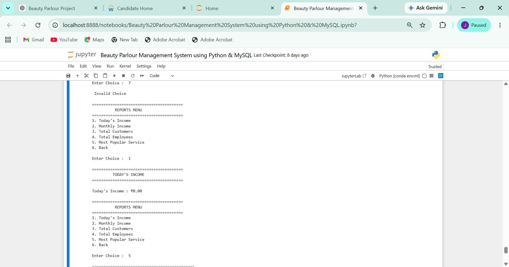

---

### 💰 Today's Income


---

### ⭐ Most Popular Services
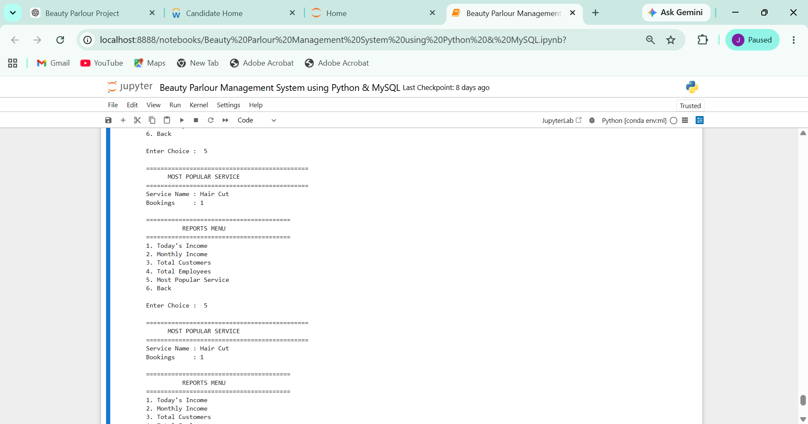

---

### 🚪 Exit
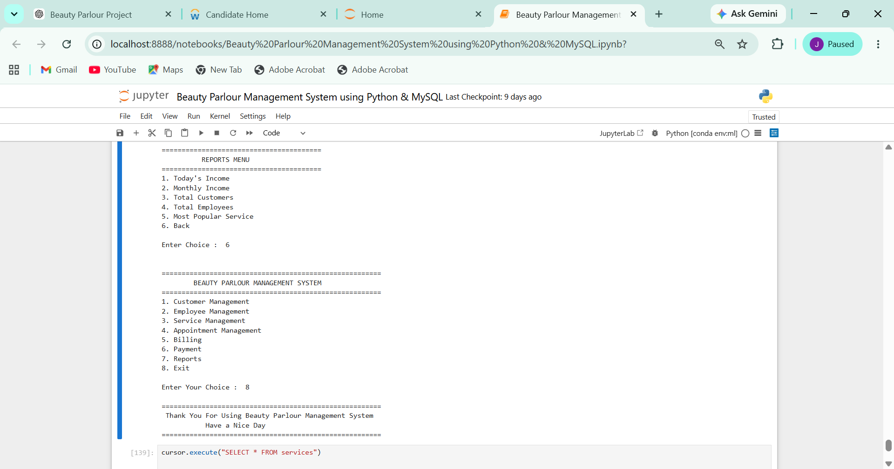

## 🔮 Future Enhancements

- Online Appointment Booking
- SMS/Email Notifications
- Inventory Management
- Customer Feedback System
- Dashboard with Graphical Reports
- Role-Based Authentication

---

## 👩‍💻 Author

**Murakonda Jasmitha**

MCA Graduate

Python | MySQL | SQL

---

## 📄 License

This project is licensed under the **MIT License**.
